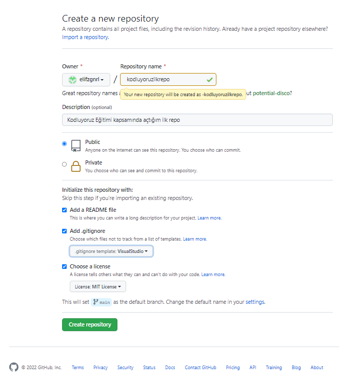

# Kodluyoruz İlk Repo 
Bu repo [Kodluyoruz](https://www.kodluyoruz.org/) Front-End Eğitiminde oluşturduğumuz ilk repo. İçerisinde bir adet REDAME.md dosyası, bir adet de index.html barındırıyor.

# Installation
Öncelikle projeyi klonlayın. 

[https://github.com/elifzgnrl/kodluyoruz/ilkrepo.git](https://github.com/elifzgnrl/kodluyoruz/ilkrepo.git)
  
# Usage
Projeyi klonladıktan sonra Visual Studio Code programında açınız.

Linux için:

cd kodluyoruzilkrepo

code .

# Contribution
Pull requestler kabul edilir. Büyük değişiklikler için, lütfen önce neyi değiştirmek istediğinizi tartışmak için bir konu açınız.

# License
[MIT](https://choosealicense.com/licenses/mit/)
